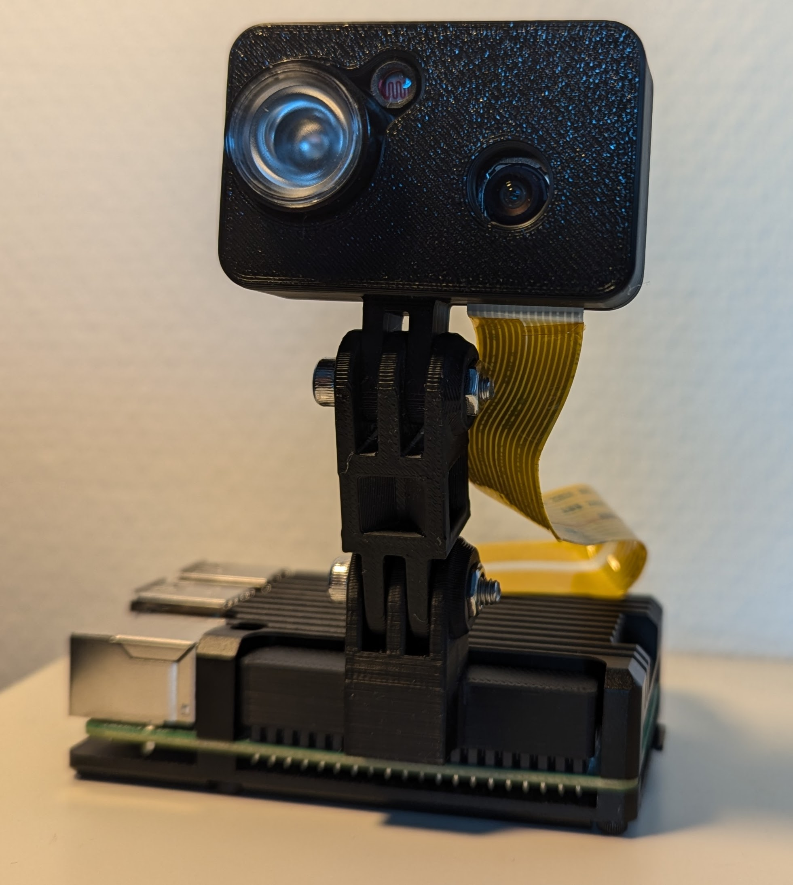

# Raspberry Pi BabyCam



# Installation
## Raspberry Pi:
- Install the latest Pi OS lite 64bit and go to Advanced Settings
  - Setup home Wifi
  - Setup Hostname `PiCam`
- Connect via shh
- Switch to root
```
sudo su
```
- Update the Pi
```
sudo apt update && apt upgrade -y
```

## Install MediaMTX :
MediaMTX will now be downloaded. Which version you use depends on Raspbian version and Pi used
- Get Raspian version 
```
uname -m
```
- Visit https://github.com/bluenviron/mediamtx/releases for latest versions and download links.
- Copy the link and enter in the terminal with wget prefix, below example I’m using the lattest (v1.9.0) 64bit version
```
wget https://github.com/bluenviron/mediamtx/releases/download/v1.9.0/mediamtx_v1.9.0_linux_arm64v8.tar.gz
```
- Extract the files
```
tar xzvf mediamtx_v1.9.0_linux_arm64v8.tar.tar.gz
```
- Edit the yml file so it uses the Pi camera
```
nano mediamtx.yml
```
- Scroll to the bottom of the file, replace the following lines of code at the end of the file
```
paths:
  # example:
  # my_camera:
  #   source: rtsp://my_camera
  # Settings under path "all_others" are applied to all paths that
  # do not match another entry.
  all_others: 
```
- With the following:
```
paths:
  cam:
    source: rpiCamera
    sourceOnDemand: true

  cam_with_audio:
    runOnDemand: >
      gst-launch-1.0
      rtspclientsink name=s location=rtsp://localhost:$RTSP_PORT/cam_with_audio
      rtspsrc location=rtsp://127.0.0.1:$RTSP_PORT/cam latency=0 ! rtph264depay ! s.
      alsasrc device=hw:0 ! opusenc bitrate=16000 ! s.
    runOnDemandRestart: yes

  all_others:
```
- The cam is now only running is someone is requesting the stream.
- additional config parameter: https://github.com/bluenviron/mediamtx/blob/main/mediamtx.yml
### Example 
  ```
  # Enables printing text on each frame.
  rpiCameraTextOverlayEnable: true
  # Text that is printed on each frame.
  # format is the one of the strftime() function.
  rpiCameraTextOverlay: '%Y-%m-%d %H:%M:%S - BabyCam'
  ```
- The stream now shows the current time.
- Save and Exit.

### Add a service:
To allow it to start automatically and for easier control of the video feed, the program can be created as service. 
```
sudo mkdir /opt/mediamtx
sudo cp mediamtx /opt/mediamtx/
sudo cp mediamtx.yml /opt/mediamtx/
```
- Remove the temp files
```
rm mediamtx
rm mediamtx.yml
rm mediamtx_v1.9.0_linux_arm64v8.tar.tar.gz
```
- Create a new service file 
```
sudo nano /etc/systemd/system/mediamtx.service
```
- Paste the following: 
```
[Unit] 
Wants=network.target
[Service] 
ExecStart=/opt/mediamtx/mediamtx /opt/mediamtx/mediamtx.yml
[Install] 
WantedBy=multi-user.target
```
- Save and Exit.
- Reload systemctl 
```
sudo systemctl daemon-reload
```
- Start the service and enable at the same time
```
sudo systemctl enable --now mediamtx
```
- To check its running 
```
sudo systemctl status mediamtx
```

### Stream URL
Local access only!
```
VLC -> rtsp://{RPI IP-Address}:8554/cam
WebRTC -> http://{RPI IP-Address}:8889/cam
HLS -> http://{RPI IP-Address}:8888/cam
```
You can also use the Pi hostname `PiCam.local` instead of IP Adress.

## Setup Tailscale:
With Tailscale remote access is easy to setup.

Install with one command:
```
curl -fsSL https://tailscale.com/install.sh | sh
```
- After Installation complete
```
tailscale up
```
- Visit the shown URL to login to your tailscale account
- Connect your device
- go to https://login.tailscale.com/admin/machines to see a list of all devices

## Setup Auto Wifi Access Point
- TBD

# Setup Android APP:

- Visit [BabyCam Google Drive](https://drive.google.com/drive/folders/15eSAh2_Q_ZZ81lj0tSRdt0VHG018Qh6l?usp=drive_link) to find the latest .apk
- Install the .apk
- Swipe from left to right to open the side menu an click `Settings`
- Enter the Local and if setup Remote URL (WebRTC recommended for low latency)
- click `Save`
- Swipe from left to right an select the right URL type

# 3D printed Housing

Customized parts can be found [here](3D_files).\
Gopro style mounting extension can be found on [Thingiverse](https://www.thingiverse.com/thing:2584426).
