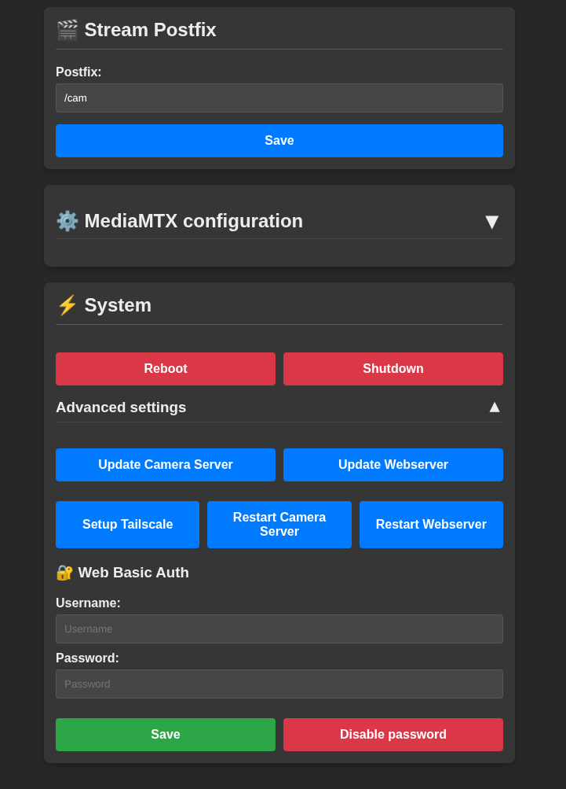

# Raspberry Pi BabyCam


# BabyCamOS
This Project ist based on [Buildroot](https://buildroot.org/) and [MediaMTX](https://github.com/bluenviron/mediamtx/)

# Installation
## Raspberry Pi OS:
If you want to use the offical Raspberry Pi OS please follow [README-rpi-OS](README-rpi-OS.md)


## BabyCamOS:
- Currently the Raspberry Pi 4 is supported, Pi Zero W2 is under development
- You can build the project from source using buildroot and the provided Makefile, this has to be done on Linux.
- Otherwise donwload the latest image under Releases
- install the image to an SD card
  - on linux use 
```
sudo dd bs=4M status=progress conv=fsync if=PATH/TO/XXX_BabyCamOS_vXXX_rpi4.img
.img of=/dev/mmcblk0
```
 - you can also use the Pi imager or similar
 
# First boot or no know network:
- Connect to wifi AP PI_BabyCam with PSK=babycam123.
- Go to 192.168.4.1 in settings and scan for new networks.
- After that you can use http://babycam or the assigned IP.



# Audio support
If you have installed a USB microphone you can set a new stream postfix to use it
```
Stream Postfix:
/cam_with_audio
```

# Basic Auth
Under `Advanced settings` you can enable basic auth this will sync your authentification creds to mediaMXT and some sensetive webserver settings. The credentials will be stored as sh256 hash on der Pi itself.

# Tailscale
To connect your camera to your tailscale network go to the settings tab and find the button `Setup Tailscale` under `Advanced settings`

# 3D printed Housing

Customized parts can be found [here](3D_files).\
Gopro style mounting extension can be found on [Thingiverse](https://www.thingiverse.com/thing:2584426).
